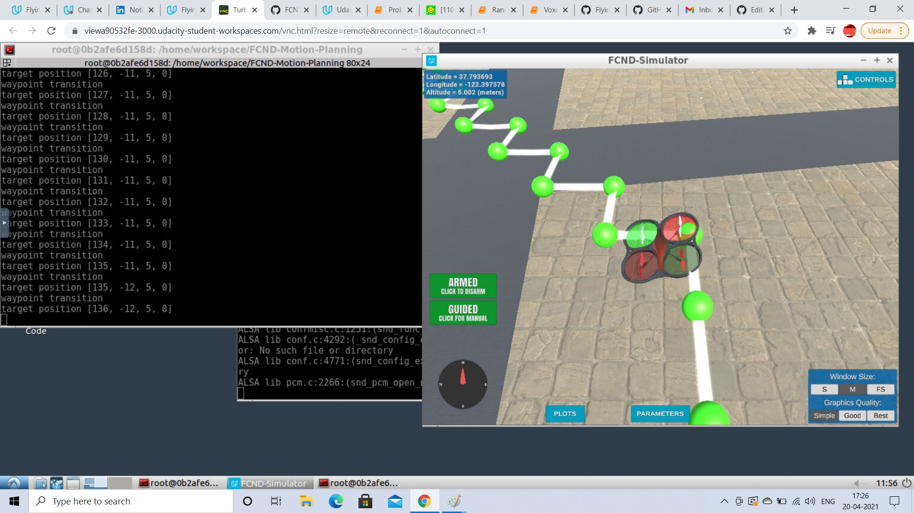

## Project: 3D Motion Planning

---

# Required Steps for a Passing Submission:
1. Load the 2.5D map in the colliders.csv file describing the environment.
2. Discretize the environment into a grid or graph representation.
3. Define the start and goal locations.
4. Perform a search using A* or other search algorithm.
5. Use a collinearity test or ray tracing method (like Bresenham) to remove unnecessary waypoints.
6. Return waypoints in local ECEF coordinates (format for `self.all_waypoints` is [N, E, altitude, heading], where the drone’s start location corresponds to [0, 0, 0, 0].
7. Write it up.
8. Congratulations!  Your Done!

## [Rubric](https://review.udacity.com/#!/rubrics/1534/view) Points
### Here I will consider the rubric points individually and describe how I addressed each point in my implementation.  

---
### Writeup / README

Here is how I have addressed each rubric point.

#### 1. Explain the functionality of what's provided in `motion_planning.py` and `planning_utils.py`

motion_planning.py is different from backyard_flyer_solution.py in the sense that it uses plan_path() method to generate waypoints and define drone path wherease backyard_flyer_solution.py uses the calculate_box() method to define set 4 waypoints and there is no planning involved. In motion_planning.py, we are using an additional state of PLANNING to generate the waypoints.

After implementing 3D motion planning, here is an image of my drone in action

### Implementing Your Path Planning Algorithm

#### 1. Set your global home position
Home position was set at line number 137 of motion_planning.py.

#### 2. Set your current local position
Current local position is set according to global_position using global_to_local method at line number 145 of motion_planning.py.

#### 3. Set grid start position from local position
north and east start positions are set from local position.

#### 4. Set grid goal position from geodetic coords
grid_goal position is set using the north and east start positions by adding to the relative offsets.

#### 5. Modify A* to include diagonal motion (or replace A* altogether)
Search was performed using A*

#### 6. Cull waypoints 
prune_path was used to minimize the number of waypoints.
